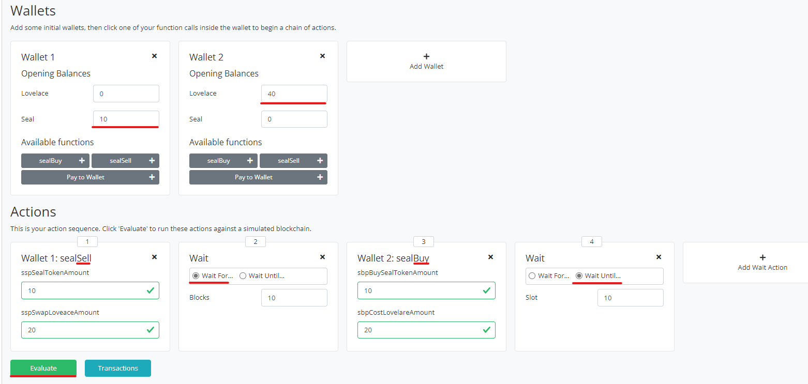
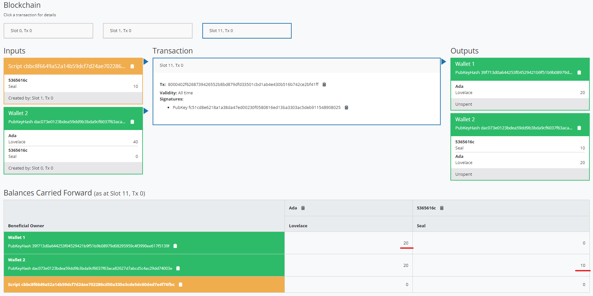

# Cardano Plutus Contracts

Here is a contracts on Cardano Plutus for swapping seal with ada. 

## Setup Playground

This demo is working on a local playground.
> The playground docker-compose from [maccam912/ppp](https://github.com/maccam912/ppp)，
> The playground is using the code about 3-4 month ago, but is newer than the public playground.

Start the playgroundy 
```
cd playground
docker-compose up
```

Wait a while, then open <https://localhost:8009/> in your favorite browser.

## Build & Test

Open in devcontainer in VSCode. Run in terminal:

```
cabal build
```

> devcontainer config: .devcontainer/devcontainer.json


## Contracts

### Swap Token

User can exchange token "Seal" with "Lovelace". This is a simple demo.

### Simulation

Copy the content of `src/swapToken.hs` to play ground. Click "Compile" then "Simulate" button.

### Scenario 1

Wallet 1 want to sell 10 seal for 20 lovelace.
Wallet 2 want to buy 10 seal.


Set up the simuation as below, then click `Evaluate`.



Then you can see after last transation, wallet 1 got 20 lovelace and wallet 2 got 10 seal.



## TOOD

- [x] Off-Chain
  - [x] Send Seal
  - [x] Send Lovelace
  - [x] Reeder Seal
  - [x] Reeder Lovelace
- [x] On-Chain
  - [x] Declare Seal
  - [x] Declare Loveace
  - [x] Exchange Pool
  - [x] Validator (only check payment)
- [ ] Upgrade to latest plutus (v1.0.6)


## Referenece

- https://github.com/input-output-hk/plutus/blob/master/README.adoc

